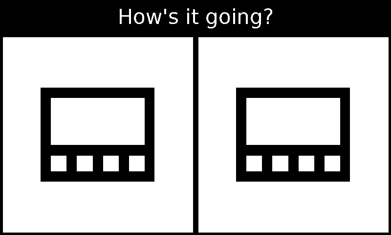

# E-Paper User Interface

A complete, flexible, and easy-to-use user interface designed
for e-paper displays

## Before Start

If you have a grayscale display, this is the right option

This library is designed for low refresh rate displays, but can also
be fine-tuned to work with higher ones

However, if you don't like python or pillow (as a dependency),
go ahead and write your own one

## Getting Started

Here's an example

```python
from ui import *

CANVAS_SIZE = (800, 480)


def main():
    image = Image.new('L', CANVAS_SIZE, 255)  # a greyscale image
    draw = ImageDraw.Draw(image)  # create a canvas
    context = Context(draw, CANVAS_SIZE)
    vgroup = VGroup(context, # vertical group is where subviews are laid vertically
                    alignment=ViewAlignmentHorizontal.CENTER,
                    prefer=ViewMeasurement.default(
                        width=ViewSize.MATCH_PARENT,
                        height=ViewSize.MATCH_PARENT
                    ))
    header = Group(context, # a simple group is where subviews are anchored on the same pot
                   prefer=ViewMeasurement.default(
                       width=ViewSize.MATCH_PARENT,
                       height=70 # 70px
                   ))
    content = HGroup(context,
                     prefer=ViewMeasurement.default(
                         width=ViewSize.MATCH_PARENT,
                         height=ViewSize.MATCH_PARENT
                     ))
    """
    view tree:
    root
    ├── vgroup
    │   ├── header: Group
    │   │   ├── Surface
    │   │   └── TextView
    │   └── content: HGroup
    │       ├── View
    │       └── View
    """
    context.root_group.add_view(vgroup)
    vgroup.add_view(header)
    vgroup.add_view(content)

    header.add_view(
        Surface(
            context,
            prefer=ViewMeasurement.default(
                width=ViewSize.MATCH_PARENT,
                height=ViewSize.MATCH_PARENT
            )
        )
    )
    header.add_view(
        TextView(
            context,
            text="How's it going?",
            font_size=24,
            fill=255, # white to be visible over black header
            align_horizontal=ViewAlignmentHorizontal.CENTER,
            prefer=ViewMeasurement.default(
                width=ViewSize.MATCH_PARENT,
                height=ViewSize.WRAP_CONTENT,
                margin_top=20
            )
        )
    )
    vgroup.add_view(
        View(context,
             prefer=ViewMeasurement.default(
                 width=ViewSize.MATCH_PARENT,
                 height=ViewSize.MATCH_PARENT
             ))
    )
    content.add_view(
        View(context,
             prefer=ViewMeasurement.default(
                 size=0.5
             ))
    )
    content.add_view(
        View(context,
             prefer=ViewMeasurement.default(
                 size=0.5
             ))
    )
    render(context)


if __name__ == "__main__":
    main()
```

To test it on your computer,
```python
from ui import *

def render(context: Context, image: Image.Image):
    context.redraw_once()
    image.show()
```

To run it on your MCU,
```python
from ui import *

def render(context: Context, image: Image):
    context.on_redraw(lambda: epd.display(image)) # use your epd driver or something
    context.start() # blocks the current thread to make sure the UI is responsive
```

You should get a render like this

